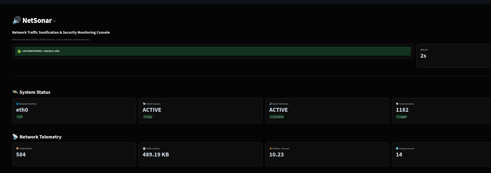
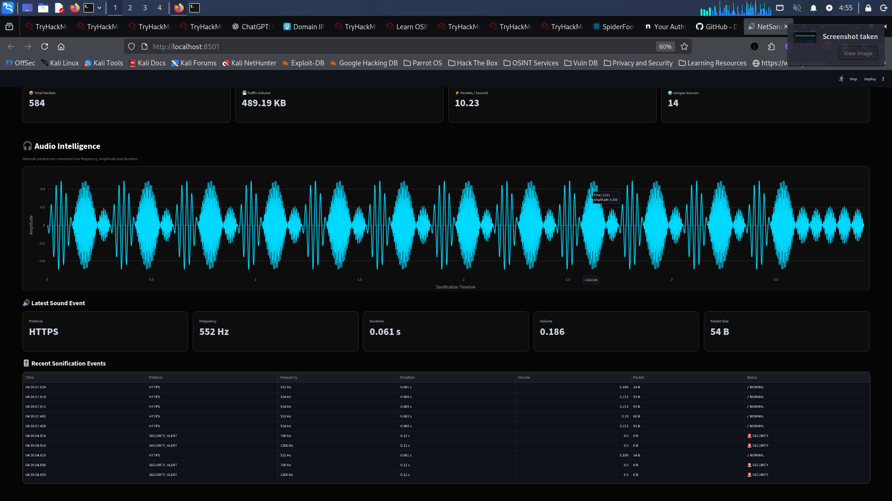
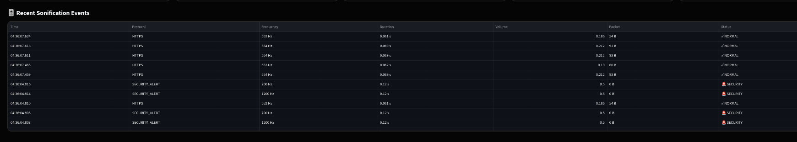
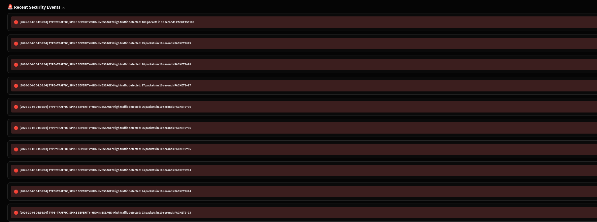

# 🔊 NetSonar

# 📸 Screenshots

## 🖥️ Live SOC Dashboard



Real-time network telemetry, security monitoring, protocol analytics, and audio intelligence.

---

## 〰️ Real-Time Audio Waveform



Network events are converted into audio telemetry and visualized as a dynamic waveform.

---

## 📡 Live Network Capture



Live packets captured from the Linux network interface and classified by protocol/service.

---

## 🚨 Security Detection



Security events such as traffic spikes and TCP SYN port scans are highlighted with severity information.

---

### Network Traffic Sonification & Security Monitoring Platform

> **TURN NETWORK TRAFFIC INTO SOUND.**
> Capture network activity, analyze traffic behavior, detect suspicious patterns, and hear what's happening on your Linux network in real time.

[](https://www.python.org/)
[](https://www.linux.org/)
[](https://scapy.net/)
[](https://streamlit.io/)
[](https://plotly.com/)
[](https://pytest.org/)

---

## 📌 Overview

**NetSonar** is a Linux-based network monitoring and security analysis platform designed to transform network traffic into both **visual and audible security telemetry**.

The system captures live packets from a Linux network interface, identifies protocols and services, calculates traffic statistics, detects suspicious activity, generates audio signals based on network characteristics, and presents the information through a real-time SOC-style dashboard.

Instead of relying only on traditional charts and logs, NetSonar introduces **network sonification** as an additional monitoring channel.

### Core concept

```text
Network Traffic
       │
       ▼
Packet Capture
       │
       ▼
Traffic Analysis
       │
       ├──────────────► Protocol / Port Analytics
       │
       ├──────────────► Anomaly Detection
       │                     │
       │                     ▼
       │                Security Events
       │
       ▼
Sonification Engine
       │
       ├──────────────► Real Audio
       │
       └──────────────► Audio Telemetry
                              │
                              ▼
                     Streamlit SOC Dashboard
```

---

# 🎯 Project Objectives

NetSonar was built to demonstrate practical Linux and cybersecurity skills in:

* Network packet capture
* Network traffic analysis
* Protocol identification
* Security anomaly detection
* TCP SYN port-scan detection
* Traffic spike detection
* Security event logging
* Audio-based security telemetry
* Real-time monitoring dashboards
* Python automation
* Linux security tooling
* Automated testing

---

# 🚀 Key Features

## 📡 Live Packet Capture

NetSonar captures live IP traffic from a Linux network interface using **Scapy**.

Supported traffic includes:

* TCP
* UDP
* ICMP
* HTTP
* HTTPS
* DNS
* SSH
* FTP
* SMTP
* NTP
* DHCP
* SNMP
* SMB
* RDP
* Other traffic

---

## 🔍 Protocol & Service Classification

Traffic is automatically classified using source and destination ports.

Example:

```text
TCP : 443  → HTTPS
TCP : 22   → SSH
TCP : 80   → HTTP
TCP : 445  → SMB
UDP : 53   → DNS
UDP : 123  → NTP
ICMP       → ICMP
```

This provides more meaningful telemetry than simply displaying TCP or UDP.

---

# 🚨 Security Detection

NetSonar currently implements lightweight behavioral detection mechanisms.

### Traffic Spike Detection

Detects unusually high packet activity within a defined time window.

Default configuration:

```text
Threshold : > 50 packets
Window    : 10 seconds
Severity  : HIGH
```

Example:

```text
[!!! SECURITY ALERT !!!]
TRAFFIC_SPIKE
Severity: HIGH
High traffic detected: 63 packets in 10 seconds
```

---

### TCP SYN Port Scan Detection

NetSonar monitors TCP SYN activity and identifies sources attempting connections across many destination ports.

Default configuration:

```text
Unique ports threshold : 10
Detection window       : 10 seconds
Severity               : HIGH
```

Example:

```text
[!!! SECURITY ALERT !!!]
PORT_SCAN
Severity: HIGH
Possible TCP SYN port scan detected
```

---

# 🔊 Network Traffic Sonification

One of the core features of NetSonar is **network traffic sonification**.

Network characteristics are converted into audio parameters.

```text
Protocol
   │
   ▼
Base Frequency
   │
   ├── Packet Size ──► Frequency
   │
   ├── Packet Size ──► Volume
   │
   └── Packet Size ──► Duration
```

### Example protocol mapping

| Protocol | Base Frequency |
| -------- | -------------: |
| TCP      |         440 Hz |
| UDP      |         660 Hz |
| ICMP     |         880 Hz |
| DNS      |        1000 Hz |
| HTTPS    |         550 Hz |
| HTTP     |         500 Hz |
| SSH      |         600 Hz |
| FTP      |         620 Hz |
| SMTP     |         680 Hz |
| NTP      |         760 Hz |
| DHCP     |         800 Hz |
| SNMP     |         820 Hz |
| RDP      |         900 Hz |
| SMB      |         940 Hz |
| OTHER    |         300 Hz |

Packet size additionally influences the generated sound.

This means different traffic characteristics produce different audible patterns.

---

# 📈 Real-Time SOC Dashboard

NetSonar includes a Streamlit-based monitoring dashboard.

The dashboard provides:

### Network Telemetry

* Total packets
* Total bytes
* Packets per second
* Unique source IPs
* Unique destination IPs

### Audio Intelligence

* Current protocol
* Frequency
* Duration
* Volume
* Packet size
* Live waveform visualization

### Network Analytics

* Protocol activity
* Destination port activity
* Traffic distribution

### Security Operations

* Security events
* High-severity events
* Port-scan detections
* Traffic-spike detections
* Recent security alerts
* Security logs

The dashboard automatically refreshes to display current telemetry.

---

# 〰️ Audio Waveform Visualization

NetSonar exports audio-event telemetry to:

```text
data/live_audio.json
```

The dashboard reconstructs the waveform from these events to visualize the sonification activity.

```text
Packet Event
     │
     ▼
Sound Engine
     │
     ├──────────► aplay
     │              │
     │              ▼
     │         Physical Audio
     │
     └──────────► Audio Telemetry
                    │
                    ▼
               Waveform Graph
```

> The waveform represents the generated sonification telemetry. It is not a microphone recording of the speaker output.

---

# 📝 Security Event Logging

Detected security events are recorded in:

```text
logs/network_events.log
```

Example:

```text
[2026-10-06 04:30:10]
TYPE=PORT_SCAN
SEVERITY=HIGH
MESSAGE=Possible TCP SYN port scan detected
SOURCE_IP=192.168.124.128
UNIQUE_PORTS=12
```

This provides a persistent record for investigation and analysis.

---

# 🧪 Testing

NetSonar includes automated tests using **pytest**.

Test coverage includes:

### Protocol Analyzer

* HTTPS classification
* HTTP classification
* SSH classification
* DNS classification
* ICMP handling

### Traffic Analyzer

* Packet counting
* Byte counting
* Protocol tracking

### Detection Engine

* Traffic spike detection
* Port-scan detection
* Normal traffic behavior

Run:

```bash
pytest
```

---

# 🛠️ Technology Stack

| Technology   | Purpose                                |
| ------------ | -------------------------------------- |
| Python       | Core development                       |
| Scapy        | Packet capture and analysis            |
| Streamlit    | SOC dashboard                          |
| Plotly       | Data visualization                     |
| PyYAML       | Configuration handling                 |
| Pytest       | Automated testing                      |
| aplay / ALSA | Linux audio playback                   |
| tcpdump      | Network troubleshooting and validation |
| Linux        | Runtime environment                    |

---

# 📂 Project Structure

```text
NetSonar/
│
├── analyzer/
│   ├── __init__.py
│   ├── anomaly_detector.py
│   ├── audio_exporter.py
│   ├── event_logger.py
│   ├── protocol_analyzer.py
│   ├── stats_exporter.py
│   └── traffic_analyzer.py
│
├── audio/
│   ├── __init__.py
│   ├── alerts.py
│   ├── sound_engine.py
│   └── tones.py
│
├── capture/
│   ├── __init__.py
│   ├── interface.py
│   └── packet_capture.py
│
├── dashboard/
│   └── dashboard.py
│
├── config/
│   └── config.yaml
│
├── data/
│   └── .gitkeep
│
├── logs/
│   └── .gitkeep
│
├── tests/
│   ├── test_analyzer.py
│   ├── test_detection.py
│   └── test_protocol_analyzer.py
│
├── .gitignore
├── CHANGELOG.md
├── LICENSE
├── pytest.ini
├── README.md
└── requirements.txt
```

---

# ⚙️ Installation

## 1. Clone the repository

```bash
git clone https://github.com/re-enter-sys/NetSonar.git
cd NetSonar
```

## 2. Create a virtual environment

```bash
python3 -m venv .venv
source .venv/bin/activate
```

## 3. Install Python dependencies

```bash
pip install -r requirements.txt
```

## 4. Install Linux audio support

Debian/Kali:

```bash
sudo apt update
sudo apt install alsa-utils
```

Verify:

```bash
aplay --version
```

---

# ▶️ Usage

## Start packet capture

```bash
sudo .venv/bin/python capture/packet_capture.py
```

The capture engine displays live traffic:

```text
[04:29:35] DNS
192.168.124.128:43258 -> 192.168.124.2:53
SIZE=71

[04:29:35] HTTPS
192.168.124.128:40024 -> 104.20.23.154:443
SIZE=1749
```

Press:

```text
CTRL+C
```

to stop the capture.

---

# 🖥️ Start the Dashboard

From the project root:

```bash
source .venv/bin/activate
streamlit run dashboard/dashboard.py
```

Then open the local Streamlit URL displayed by the terminal.

The dashboard reads live telemetry from:

```text
data/live_stats.json
data/live_audio.json
logs/network_events.log
```

For the best experience, keep packet capture running in one terminal and the dashboard running in another.

---

# 🔬 Validation

NetSonar was validated against real traffic generated through the Linux VMware environment.

Example observed traffic:

```text
ICMP
DNS
HTTPS
```

Example captured statistics:

```text
Packets          : 21
Total bytes      : 3388
Packets/sec      : 1.03
Unique sources   : 3
Unique targets   : 3

Protocols:
  ICMP           : 8
  DNS            : 4
  HTTPS          : 9
```

The same captured packets generated corresponding audio telemetry events.

---

# 🛡️ MITRE ATT&CK Relevance

NetSonar is primarily a **defensive monitoring and detection project**.

The detection capabilities can support investigation of activity associated with:

| Detection                  | ATT&CK Relevance                  |
| -------------------------- | --------------------------------- |
| TCP SYN port scanning      | T1046 — Network Service Scanning  |
| Abnormal traffic volume    | T1498 — Network Denial of Service |
| Network traffic monitoring | Defensive network visibility      |

> ATT&CK mappings are contextual associations between detected behavior and the framework; NetSonar does not claim to detect the full techniques independently.

---

# 🔐 Security Considerations

NetSonar is intended for:

* Defensive security monitoring
* Authorized network analysis
* Security labs
* SOC learning
* Controlled testing environments

Packet capture may require elevated privileges.

Only monitor networks and systems where you have appropriate authorization.

The project does not intentionally transmit captured traffic to external services.

---

# ⚠️ Limitations

Current implementation focuses on lightweight network telemetry and behavioral detection.

It does not currently provide:

* Full IDS signature detection
* Deep packet inspection
* TLS decryption
* Enterprise SIEM integration
* Distributed sensor deployment
* Machine-learning-based anomaly detection
* Persistent database storage

These are possible future enhancements.

---

# 🗺️ Roadmap

### Completed

* [x] Linux packet capture
* [x] Traffic analysis
* [x] Protocol classification
* [x] Traffic statistics
* [x] Traffic-spike detection
* [x] TCP SYN port-scan detection
* [x] Security event logging
* [x] Dynamic audio generation
* [x] Audio telemetry
* [x] Live waveform visualization
* [x] SOC-style dashboard
* [x] Automated tests

### Future

* [ ] PCAP replay mode
* [ ] GeoIP visualization
* [ ] Advanced behavioral analytics
* [ ] Machine-learning anomaly detection
* [ ] SQLite event database
* [ ] Alert correlation
* [ ] Email/webhook notifications
* [ ] Docker deployment
* [ ] Multi-interface monitoring
* [ ] SIEM integration
* [ ] Advanced threat scoring

---

# 💡 Why NetSonar?

Traditional network monitoring primarily relies on:

```text
Charts + Logs + Alerts
```

NetSonar experiments with an additional monitoring channel:

```text
Charts + Logs + Alerts + Sound
```

The goal is not to replace conventional security monitoring, but to explore whether **auditory cues can provide another way of recognizing changes in network behavior**.

---

# 👨‍💻 Skills Demonstrated

This project demonstrates practical experience with:

* Linux
* Python
* Network security
* Packet analysis
* Scapy
* TCP/IP
* DNS
* HTTPS
* Network monitoring
* Security detection
* Anomaly detection
* SOC dashboards
* Security event logging
* Data visualization
* Audio processing
* Linux system administration
* Automated testing
* Git/GitHub

---

# 📜 License

This project is licensed under the MIT License.

See [`LICENSE`](LICENSE) for details.

---

# 👤 Author

**Ch Viswa**

Cybersecurity / Security Analyst Candidate

Focus areas:

* SOC Operations
* Network Security
* Threat Detection
* Vulnerability Assessment
* Linux Security
* Security Automation

---

## ⭐ Project Status

**Status: Completed**

NetSonar is a portfolio and cybersecurity-learning project demonstrating real-time Linux network monitoring, anomaly detection, security telemetry, and network sonification.
